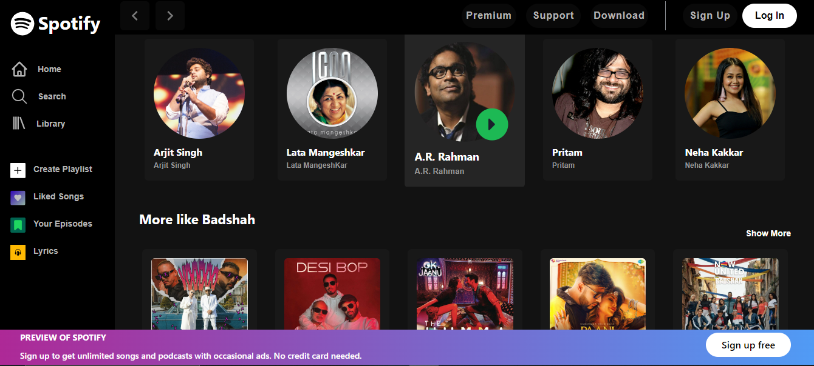

# Spotify-Clone

## About the Project

This Spotify-Clone project was developed by a group of four members, with the goal of creating a fully responsive web application that mirrors the design and functionality of Spotify. The project includes several key features to provide a seamless music streaming experience.

## Features

  
  

- **Responsive Design:** The home and search pages are fully responsive, providing an optimal user experience across all devices, including desktops, tablets, and smartphones.
- **Home Page:** A landing page that closely resembles Spotify's interface, showcasing popular playlists, albums, and artists.
- **Search Page:** A search functionality that allows users to find their favorite songs, artists, and albums with ease.
- **Like Songs:** Users can like and save their favorite songs to create a personalized music library.
- **Lyrics Display:** A dedicated page to view lyrics of the currently playing song.
- **Premium Features:** A section promoting Spotify's premium features, encouraging users to upgrade for an enhanced experience.
- **Authentication:** Secure Google and Facebook authentication has been implemented, allowing users to sign in or sign up easily.

## Technologies Used

- **Frontend:** HTML, CSS, JavaScript
- **Backend:** [Include backend technologies if applicable]
- **Authentication:** Google Authentication, Facebook Authentication
- **Version Control:** Git & GitHub

Contributing
Contributions are what make the open-source community such an amazing place to learn, inspire, and create. Any contributions you make are greatly appreciated.

Fork the Project
Create your Feature Branch (git checkout -b feature/AmazingFeature)
Commit your Changes (git commit -m 'Add some AmazingFeature')
Push to the Branch (git push origin feature/AmazingFeature)
Open a Pull Request
License
Distributed under the MIT License. See LICENSE.txt for more information.
